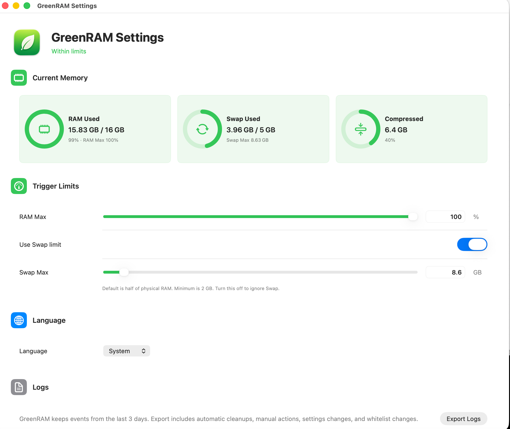

# GreenRAM

[English](README.md) | [更新日志](CHANGELOG.zh-CN.md)

GreenRAM 是一个 macOS 菜单栏 App。它会观察内存状态，并在后台 App 达到可配置的非前台时间后强制退出这些 App。

它解决的是一个简单问题：让当前前台 App 保持响应，把长时间停在后台的 App 清掉。

## 截图

### 菜单


### 设置



## 功能

- 菜单栏内存状态，使用绿色 / 红色叶子图标。
- RAM 和 Swap 状态展示，并支持配置显示阈值。
- 自动退出 App 列表中的 App 在达到配置的后台时间后会自动结束。
- 手动 `Clean Apps Now` 操作。
- 可编辑白名单，用于保护不应退出的 App。
- 多进程内存统计，覆盖浏览器、Electron App、Xcode helper 等 App 进程树。
- 本地化 UI：简体中文、繁体中文、英文、日文、德文、法文。

## 支持的 macOS 版本和架构

- macOS 13.0 Ventura 或更新版本，包括 macOS 14 Sonoma 和 macOS 15 Sequoia。
- 发布包是 Universal 2，同时支持 Apple Silicon (`arm64`) 和 Intel (`x86_64`) Mac。
- 本地 SwiftPM 构建默认使用当前 Mac 架构，除非你显式构建 Universal 2 二进制文件。

## 当前清理策略

一个 App 只有同时满足以下条件，才会被视为可清理：

- 它是带 Bundle ID 的普通 macOS GUI App。
- 它不是 GreenRAM 自己。
- 它不是当前 macOS 前台 App。
- 它在自动退出 App 列表中。
- 它不在白名单中。Finder、Dock、WindowServer、System Settings、System Preferences 默认在白名单里，但每个白名单项都可以在 Settings 中移除。
- 它的非前台时间达到该 App 配置的后台时间阈值。

添加新的自动退出 App 规则时，默认自动退出时间是 30 分钟。这个值可以在 Settings 中修改，最低 3 分钟。

自动退出 App 只要满足自己的非前台时间限制就会自动退出。RAM 和 Swap 状态不会延后执行。

自动退出 App 列表和白名单互斥。把一个 App 加入其中一个列表，会把它从另一个列表中移除。

App 类型、Bundle ID 关键词、App 名称关键词、内存用量，都不决定某个 App 是否可清理。

当多个 App 都可清理时，GreenRAM 会优先处理非前台时间最长的 App。内存只作为排序并列时的次要条件，也用于状态展示。

每次自动清理默认最多强制退出 3 个可清理 App。自动清理有 60 秒冷却时间，同一个 Bundle ID 在 10 分钟内不会重复请求退出。自动清理不会等待 RAM 或 Swap 超过显示阈值。手动 `Clean Apps Now` 使用同一套可清理条件。

## 永不退出规则

GreenRAM 永远不会退出：

- 当前前台 App
- 白名单 App
- 不在自动退出 App 列表中的 App
- 未达到配置后台时间阈值的后台 App

## 下载

从 [Releases](../../releases) 页面下载最新已签名并完成 notarize 的 DMG。

## 构建

```sh
swift build -c release
```

本地运行：

```sh
swift run GreenRAM
```
